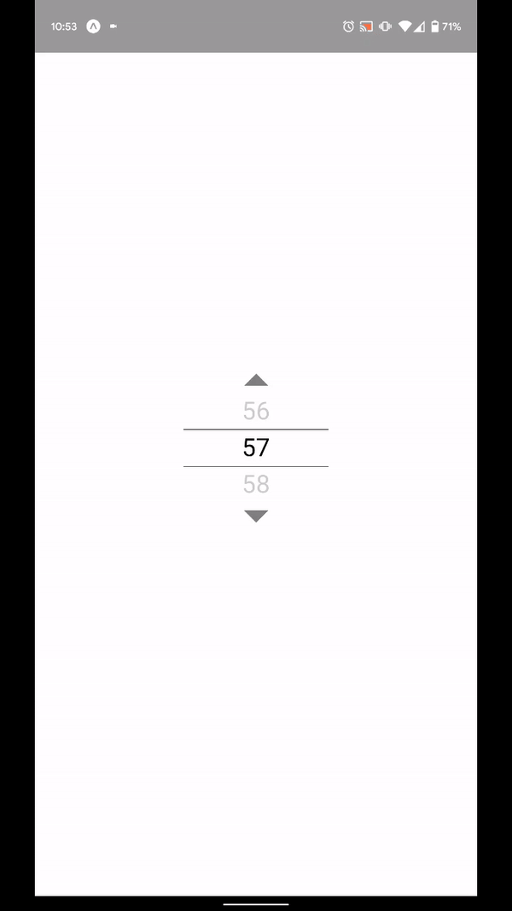

# react-native-spin-picker

A pure react native, spinner style select list with a simple interface.

<p align="center">
    
</p>

## Features

- Snap to element selection
- Text input
- Single or long-press button navigation
- Flat list style jsx interface
- Customisable

## Setup

This library is available on npm, install it with: `npm i react-native-spin-picker` or `yarn add react-native-spin-picker`.

## Usage

```typescript jsx
    render() {
        return (
            <SpinPicker
                data={[...Array(100).keys()]}
                value={this.state.selectedItem}
                onValueChange={selectedItem => this.setState({selectedItem})}
                keyExtractor={number => number.toString()}
                renderItem={item => <Text>{item.toString()}</Text>}/>
        );
    }
```
## A complete example

```typescript jsx
import React from 'react';
import {SafeAreaView, Text, View} from 'react-native';
import {SpinPicker} from 'react-native-spin-picker'

interface AppState {
  selectedItem: number
}

const styles = StyleSheet.create({
  container: {
    flex: 1,
    alignItems: 'center',
    justifyContent: 'center',
    backgroundColor: '#fff'
  }
});

export default class App extends React.Component<{}, AppState> {
  constructor(props) {
    super(props);

    this.state = {
      selectedItem: 57
    };
  }

  render() {
    return (
        <SafeAreaView style={styles.container}>
          <View>
            <SpinPicker 
                    data={[...Array(100).keys()]}
                    value={this.state.selectedItem}
                    onValueChange={selectedItem => this.setState({selectedItem})}
                    keyExtractor={number => number.toString()}
                    showArrows
                    onInputValueChanged={this.onValueChanged}
                    renderItem={item => <Text>{item.toString()}</Text>}/>
          </View>
        </SafeAreaView>
    );
  }

  private onValueChanged = (value: string, previousValue: string): string => {
    const numberValue = Number(value);
    if (!isNaN(numberValue) && numberValue < 100) {
      this.setState({selectedItem: numberValue});
      return value;
    }

    return previousValue;
  };
}
```

## Available props

| Name                           | Type             | Default                        | Description                                                                                                                                |
| ------------------------------ | ---------------- | ------------------------------ | ------------------------------------------------------------------------------------------------------------------------------------------ |
| data                           | array            | **required**                   | An array of any data to be presented                                                                                                       |
| value                          | any              | **required**                   | Value that is currently selected                                                                                                           |
| onValueChange                  | function         | **required**                   | Called whenever the selected item changed, should update value prop                                                                        |
| renderItem                     | function         | **required**                   | Renders list items, **all items should be rendered with the same height (use fixed height if possible)**                                   |
| keyExtractor                   | function         | **required**                   | Extracts a unique key from each data item, used for object comparison                                                                      |
| showArrows                     | bool             | false                          | Shows navigation arrows                                                                                                                    |
| onInputValueChanged            | function         | undefined (no text input)      | Include to enable text entry, return value updates input (allows formatting or restrictions)                                               |
| textInputProps                 | object           | undefined                      | Input props applied to text input when enabled by onInputValueChanged (allows for input type, etc)                                         |
| textInputStyle                 | object           | undefined                      | Input style applied to text input when enabled by onInputValueChanged                                                                      |